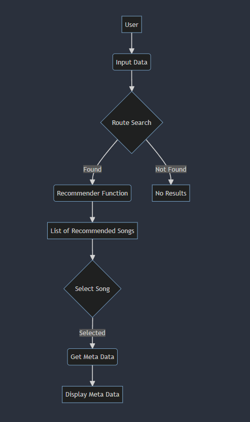

# Spotify Song Recommendation System

Implementation of web application using 
   

## Getting Started

This project consists of Flask application for the backend API, React for client side application.This project also use `docker-compose` to make it easy run all of the container at once.

This application will showcase:

This application will showcase:

- React for the frontend.
- Flask API that shows routes.
- Spotify API to fetch meta data of the selected song.

### Flask API Working:


### Prerequisites

Before you run this application make sure you have this installed in your machine:

- [Docker Desktop](https://www.docker.com/products/docker-desktop)
- [docker-compose](https://docs.docker.com/compose/install/)
- [NPM](https://www.npmjs.com/)


### Running app as a container on Docker

I have pushed the docker image to the docker hub and you can pull it using below given scripts:

Login to Docker:

```
$ docker login -u "<username>" -p "<password>" docker.io 

```
#### Pull the Docker Image:

```
$ docker pull siddharthc23/react-flask-app-client:latest   
$ docker pull siddharthc23/react-flask-app-api:latest   
```
Docker Image Pulled:


Run the Docker Container:
```
$ docker run -d -p 3000:3000 siddharthc23/react-flask-app-client:latest
$ docker run -d -p 5000:5000 siddharthc23/react-flask-app-api:latest

```
Docker Container:


After you run above commands you can open the application from [http://localhost:3000/](http://localhost:3000/)


## Running app on Local Machine

Follow these steps to set up and run the application on your local machine:

Clone the Repository:
```
$ https://github.com/SiddharthChavan23/Music_Recommendation.git
$ cd Music_Recommendation

```

Create a new virtual environment:
```
$ python -m venv venv

```
Activate the virtual environment:
```
$  venv\Scripts\activate

```
Download dependencies using the requirements.txt file:
```
$  pip install -r requirements.txt

```

Client ID and Secret: [](https://developer.spotify.com/dashboard)(Click above)
```
src
├── backend
│   └── main.py


client_id = ''
client_secret = ''


```

## Screenshots


Install Dependencies(Flask):
```
$  npm install

```

Host Front-End Locally:
```
$  npm start

Locally hosted on : http://localhost:3000/

```
Run Flask API:
```
$  flask --app main run
Locally hosted on : http://127.0.0.1:5000/

```


### Project Screenshot


Home


Search Results

Recommendations

Song MetaData


## Model 
[Training Notebook](Model.ipynb)

The model diverges from traditional recommendation engines by leveraging song features instead of user interactions. Using Nearest Neighbor models, it compute similarities between songs based on their feature vectors, offering clear and interpretable recommendations.

## Dataset used
```
Vatsal Mavani. (n.d.). Spotify Dataset 1921-2020, 160k+ Tracks (Version 1.0) [Data set]. Kaggle. 
```
[Link to Dataset](https://www.kaggle.com/datasets/vatsalmavani/spotify-dataset)


### Dataset Description


| Column Name       | Description                                                |
|-------------------|------------------------------------------------------------|
| track_id          | Unique identifier for each track                            |
| artists           | Names of the artists associated with the track              |
| album_name        | Name of the album the track belongs to                      |
| track_name        | Name of the track                                          |
| popularity        | Popularity score of the track                               |
| duration_ms       | Duration of the track in milliseconds                       |
| explicit          | Indicator of explicit content (1 for explicit, 0 for not explicit) |
| danceability      | Danceability score of the track                             |
| energy            | Energy level of the track                                   |
| key               | Key of the track                                            |
| loudness          | Loudness level of the track                                  |
| mode              | Mode of the track (Major or Minor)                          |
| speechiness       | Speechiness score of the track                              |
| acousticness      | Acousticness score of the track                             |
| instrumentalness  | Instrumentalness score of the track                         |
| liveness          | Liveness score of the track                                 |
| valence           | Valence score of the track                                  |
| tempo             | Tempo of the track                                          |
| time_signature    | Time signature of the track                                 |
| track_genre       | Genre of the track                                          |


## Problems Faced
| Problem                                     | Solution                                                                                   |
|---------------------------------------------|-------------------------------------------------------------------------------------------|
| Docker Compose to Orchestrate Containers    | Went through the Docker Compose documentation to understand and implement orchestration and special thanks to [Miguel Grinberg](https://blog.miguelgrinberg.com/post/how-to-dockerize-a-react-flask-project) forum explanation on Orchestration of containers. |
| Model Not Evaluated                         | As the model is not content-based and does not track user patterns, evaluation metrics are not applicable. Plan to implement user engagement tracking for evaluation in the future. |


